# GitGiggle Bot Squad — Workflow Demonstrations

Nine funny-named task bots, bootstrapped from the **Beeper** and **Prana** patterns in `apps/`. Each bot is a self-contained Python agent: `config/agent.yml` + `scripts/run.py` + `logs/`.

## Elder Statesmen (the templates)

| Bot | Path | What it does | Trigger |
|-----|------|--------------|---------|
| **Beeper** | `apps/beeper/` | AI news digest → HTML email via Brevo | GitHub Actions cron + manual |
| **Prana** | `apps/prana/` | Ashtanga daily lesson plan from student `.md` files | GitHub Actions cron + manual |

**ParsePilot** (`apps/parsepilot/`) is the unified multi-task runner — all 9 tasks in one mega-prompt via `run_task.py {task_id}`.

---

## Full Roster

| Task | Folder | Display Name | Tagline |
|------|--------|--------------|---------|
| 1.1 | `mimemcmarkdown` | **Mimey McMarkdown** | Your email's MIME type is my love language. |
| 1.2 | `tickettornadoterry` | **Ticket Tornado Terry** | Spins your inbox into a JIRA CSV cyclone. |
| 2.1 | `propellerpete` | **Propeller Pete of Taipei** | Taiwan corporate drone intel with extra propeller flair. |
| 2.2 | `rolodexraccoon` | **Rolodex Raccoon** | Digs through trash — I mean threads — for CRM gold. |
| 3.1 | `vaultwhisperer` | **Vault Whisperer Wendy** | Your Obsidian vault's gossip columnist — but professional. |
| 3.2 | `podiumpolly` | **Podium Polly** | From bullet points to standing ovation — rhetorically speaking. |
| 3.3 | `memoirmachine` | **Memoir Machine Mark** | Class transcripts in, Pulitzer vibes out (no guarantees). |
| 4.1 | `audiopotluck` | **Audio Potluck Patty** | Everyone brings a recording format; I bring the merge plan. |
| 4.2 | `minutesmeantime` | **Minutes Mean Time** | Mean time between meetings, zero mean time to action items. |

---

## Setup (once)

```powershell
# From GitGiggle repo root
$env:ANTHROPIC_API_KEY = "sk-ant-..."

# Install deps for any bot (same requirements everywhere)
pip install -r apps/mimemcmarkdown/scripts/requirements.txt
```

---

## Task 1.1 — Mimey McMarkdown (Email PDF → Markdown)

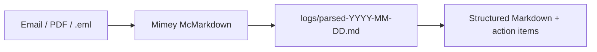

**Demo run:**

```powershell
cd apps/mimemcmarkdown
python scripts/run.py --file ../../tools/bot-squad/demo-inputs/1.1-email-thread.txt
# → logs/parsed-2026-05-25.md
```

**Expected output sections:** YAML frontmatter, thread chronology, hyperlinks, `## Action Items`.

---

## Task 1.2 — Ticket Tornado Terry (JIRA CSV)

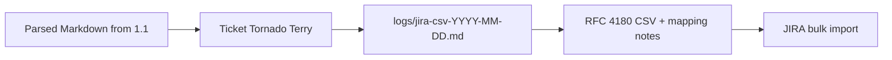

**Pipeline demo (1.1 → 1.2):**

```powershell
# Step 1: parse
cd apps/mimemcmarkdown
python scripts/run.py --file ../../tools/bot-squad/demo-inputs/1.1-email-thread.txt

# Step 2: spin into JIRA CSV
cd ../tickettornadoterry
python scripts/run.py --file ../mimemcmarkdown/logs/parsed-2026-05-25.md
# Or use pre-parsed sample:
python scripts/run.py --file ../../tools/bot-squad/demo-inputs/1.2-parsed-email.md
```

**Expected CSV columns:** `Summary`, `Description`, `Issue Type`, `Priority`, `Assignee`.

---

## Task 2.1 — Propeller Pete of Taipei (Drone Research)

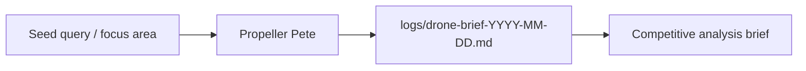

**Demo run:**

```powershell
cd apps/propellerpete
python scripts/run.py --file ../../tools/bot-squad/demo-inputs/2.1-drone-research-seed.txt
```

**Expected sections:** Executive Summary, Key Players table, Regulatory Snapshot, Trends, Sources.

---

## Task 2.2 — Rolodex Raccoon (Contact Extraction)

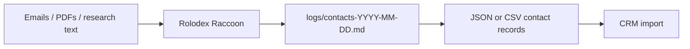

**Demo run:**

```powershell
cd apps/rolodexraccoon
python scripts/run.py --file ../../tools/bot-squad/demo-inputs/2.2-communications-dump.txt
```

**Expected fields:** `full_name`, `title`, `company`, `email`, `phone`, `confidence`, `## Review Queue`.

---

## Task 3.1 — Vault Whisperer Wendy (RAG Message Drafting)

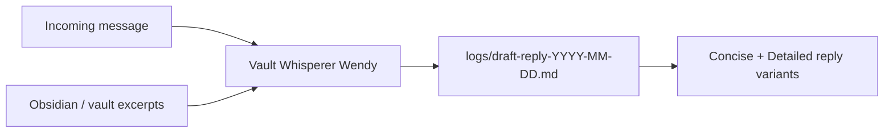

**Demo run:**

```powershell
cd apps/vaultwhisperer
python scripts/run.py --file ../../tools/bot-squad/demo-inputs/3.1-message-plus-vault-context.md
```

**Expected output:** Two reply variants + `## Context Used` citations.

---

## Task 3.2 — Podium Polly (Speech & Presentation)

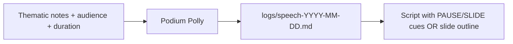

**Demo run:**

```powershell
cd apps/podiumpolly
python scripts/run.py --file ../../tools/bot-squad/demo-inputs/3.2-keynote-notes.md
```

---

## Task 3.3 — Memoir Machine Mark (Autobiography)

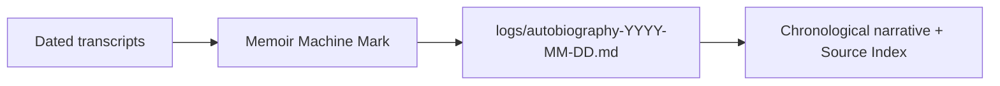

**Demo run:**

```powershell
cd apps/memoirmachine
python scripts/run.py --file ../../tools/bot-squad/demo-inputs/3.3-class-transcripts.txt
```

---

## Task 4.1 — Audio Potluck Patty (Audio Consolidation)

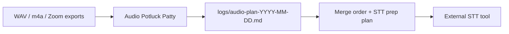

**Demo run:**

```powershell
cd apps/audiopotluck
python scripts/run.py --file ../../tools/bot-squad/demo-inputs/4.1-recording-inventory.txt
```

**Note:** Patty plans consolidation; she does not transcribe unless you provide a transcript.

---

## Task 4.2 — Minutes Mean Time (Meeting Minutes)

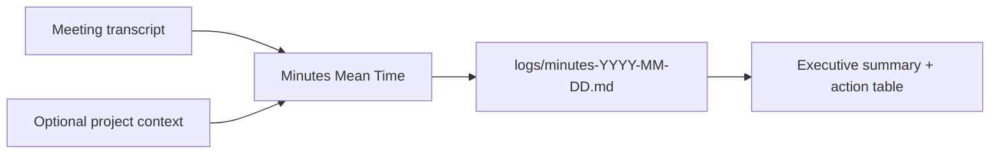

**Full audio pipeline (4.1 → STT → 4.2):**

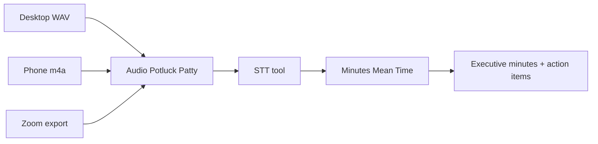

**Demo run:**

```powershell
cd apps/minutesmeantime
python scripts/run.py --file ../../tools/bot-squad/demo-inputs/4.2-standup-transcript.txt
```

---

## ParsePilot — Unified Runner

Run any task by ID without switching directories:

```powershell
cd apps/parsepilot
python scripts/run_task.py 1.1 --file ../../tools/bot-squad/demo-inputs/1.1-email-thread.txt
python scripts/run_task.py 1.2 --file ../../tools/bot-squad/demo-inputs/1.2-parsed-email.md
python scripts/run_task.py 4.2 --file ../../tools/bot-squad/demo-inputs/4.2-standup-transcript.txt
```

---

## End-to-End Pipeline Demos

### Document → JIRA (Tasks 1.1 + 1.2)

```powershell
.\tools\bot-squad\run_demo.ps1 -Pipeline inbox-to-jira
```

### Research → Contacts (Tasks 2.1 + 2.2)

```powershell
.\tools\bot-squad\run_demo.ps1 -Pipeline research-to-crm
```

### Audio → Minutes (Tasks 4.1 + 4.2)

```powershell
.\tools\bot-squad\run_demo.ps1 -Pipeline audio-to-minutes
```

### Run all demos (dry-run, no API calls)

```powershell
.\tools\bot-squad\run_demo.ps1 -DryRun
```

---

## Architecture (how bots relate to Beeper/Prana)

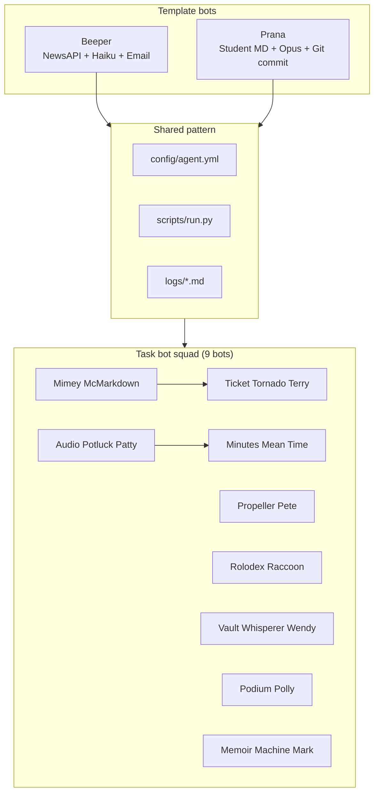

**Convention:** Each bot reads `config/agent.yml` (model, max_tokens, system_prompt), accepts `--input` or `--file`, calls Anthropic API, writes dated output to `logs/`.

---

## Re-bootstrap bots

To regenerate all 9 bots from the bootstrap script:

```powershell
python tools/bootstrap_task_bots.py
```

---

## Cost ballpark

| Bot | Model | Per run |
|-----|-------|---------|
| Beeper | Haiku | ~$0.01 |
| Prana | Opus | ~$0.05 |
| Task squad | Opus | ~$0.10–0.25 each |
